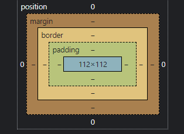

# CSS Design Doc

---

- [The Problem](#the-problem)
    - [Abstract](#abstract)
    - [`px` Values](#px-values)
    - [`position: absolute`](#px-values)
- [How to Design](#how-to-design)
    - [How Sizing Actually Works](#how-sizing-actually-works)
    - [The `margin` and `padding` Principle](#the-margin-and-padding-principle)
    - [The Column and Row Principle](#the-column-and-row-principle)
    - [How do I Use Rows and Columns?](#how-do-i-use-rows-and-columns)
        - [Why Not Grid](#why-not-grid)
    - [Combining Rows/Columns with Margin/Padding](#combining-rowscolumns-with-marginpadding)
    - [How to Make Mobile Friendly Layouts?](#how-to-make-mobile-friendly-layouts)
    - [Other Notable Things](#other-notable-things)


---

## The Problem


### Abstract

How do you design a page that just works on every device, and is easy to maintain/update?

**The Answer:**
Realistically, you don't, but designing a page that works on *most* devices, with minimal refactoring/headaches is dead-simple if you follow certain methods.

The goal is to design a page that's flexible *during* development, so you don't spend ages refactoring it everytime you make design change.

### `px` Values

The original sin of HTML and CSS is using pixel values to size elements. The problem obvious: when viewing websites on different devices, different devices have different font-sizes/default-zoom based on their physical screen size. Aka a 65" TV and my cell phone both have 4K displays, but my phone still shows everything as 4x bigger. 

Because of this, we want different parts of our pages to scale either relative to the window, or with the font-size of the device. Using `px` does neither of those.

There are two units to use instead, based around font size:

- `rem`: the root font size of the document (default `16px`, or 16 point, on Windows w/ 100% scaling).
- `em`: same as `rem`, but scales with the current element's font size.

`rem` should be used as a direct replacement for `px`, `em` should be used to anything you want to scale with text directly (text decorations, potentially padding? Basically if you set a padding of `1em`, the padding will increase with `font-size`).

### `position: absolute`

##### *along with `top:`, `left:`, etc.

Website design courses often fail to teach you about the best way to *plan* and *design* your page, before actually writing it. They basically just let you run free with the safety off, like a toddler with a handgun.

This often leads to you rewriting massive parts of your page every time you want to change something's position.

This is because as you're writing/planning on the fly, you can only think about each individual element and where you want them to go, rather than how every element will fit/position relative to each other. This leads to exessive use of `position: absolute`, which leads to parts of your page not interacting with each other.

Absolute positioning has its place, though. For example, if you want to have a navbar at the top of the screen, instead of doing this:
```css
nav {
    width: 100%;
}
```
```html
<body>
    <nav></nav>
    <main>
        <!-- OTHER STUFF -->
    </main>
</body>
```
consider doing this:
and putting the `<nav>` at the root of the `<body>`, put the `<nav>` in a relevant spot in the body, and do:
```css
nav {
    position: absolute;
    width: 100vw;
    top: 0;
    left: 0;
}
```
```html
<body>
    <main>
        <nav></nav>
        <!-- OTHER STUFF -->
    </main>
</body>
```

> Note `vw` instead of `%`. `%` is "percent of parent element width/height", whereas `vw`/`vh` is screen width/height. Useful for making non-root elements take up the full screen w/ `absolute`/`fixed`/etc.

While this might seem dumb (realistically, you wouldn't catch this beforehand), but because we explicitly *don't* want our floating `nav` to interact with anything else, we use `absolute`. **However**, if we later wanted to add a different nav for mobile, we wouldn't have to refactor our HTML/layout to move `nav` into `main`, or do janky CSS hacks.

> This is kinda a bad and long example, but you get the idea: work smarter not harder.

## How to Design

### How Sizing Actually Works

If I have two nested empty divs:
```html
<div>
    <div>
    </div>
</div>
```
The size of both `div`s is `0px` by `0px`.

If I add an `` inside the inner `div`, then both `div`s will become `50x50`. This is because both `div`s **don't** have a fixed size, but we've introduced a fixed size child.

##### A parent's size is determined by its childrens' sizes.

If we give the outer `div` a fixed width of `30px`, this causes your layout to break. Depending on the display properties of the children/parent, this will result in content overflow, content being cut off, or a scroll bar.

Long story short, try to only use fixed sizes on small individual elements, rather than larger components, which are more likely to break the layout on different screen sizes.

### The `margin` and `padding` Principle

Every HTML element is made up of several layers.



By default, an elements "shape" is defined by the line between the `border` layer, and the `padding` layer. This can be slightly changed via the `box-sizing` property.

This means that if we take an element with a size of `50x50`, and set `margin: 5px`, it will attempt to grow 5 pixels in each direction. This will cause its parent to grow, and its parent's parent to grow, etc.

Take that same element, but instead set `padding: 5px`. Instead of making its parent grow, it will make its children shrink.

In both situations, if one of the parents along the chain doesn't have space to grow, or one of the children along the chain doesn't have space to shrink, this will cause a layout break. So, as mentioned before, try to avoid fixed sizing on larger components.

*So, that covers spacing, what about alignment though?*

### The Column and Row Principle

Many CSS frameworks, including Bootstrap, rely on the principle of containers, rows and column. Here's an example of how you might structure a page


> NOTE: Absolute positioning is not used anywhere in this example.

By designing our page using rows and columns (modularizing the components of our page), we can get 2 major advantages:

1. Breaking layout changes only affect sibling elements of that component, but not their parent or children.
1. Adding layouts for mobile, monitors, etc. is just a matter of switching some rows into columns, and vice versa (using `flex-direction: row | row-reverse | column | column-reverse`).

### How do I Use Rows and Columns?

#### `display: flex`

[Check this guide out for flexbox](https://css-tricks.com/snippets/css/a-guide-to-flexbox/)


#### Why Not Grid?

To make your life 100x easier, grid should **absolutely not** be used unless you require exact and fine tuned placement of elements. Grid is an extremely powerful tool, but does **nothing** to help you build a fluid layout.

##### In grid, you define the grid cells' shape and size. In flexbox, you define alignment and layout behaviour, and let each element be whatever size it needs.

Keep in mind, when your `grid` container has different types of elements, it *will* break when screen size/orientation/font scaling changes.

### Combining Rows/Columns with Margin/Padding

Here's how you do it:
1. Make a row/column
1. Insert more rows/columns/other components into your row/column
1. If necessary, apply a fixed width/height to your row/column to make it fit within its parent
1. Apply the relevant flexbox properties to align your children how you want
1. Add `margin`/`padding` row/column and rows/columns to make them spaced out how you want
6. Rinse and repeat for child rows/columns

### How to Make Mobile Friendly Layouts?

##### Without a CSS framework, it's very difficult to manage any fixed sizes on your flexbox rows/columns, effectly causing layout breaks everywhere. Fixed sizes will always be the weakest link in a fluid layout.

To combat this, most websites go for a mobile-first design, but disguise it on desktop/landscape displays. It's a neat trick, here's how it works.

Look at the picture in the [The Column & Row Principle](#the-column--row-principle) section. Notice how the main row of the page consists of two columns, on with the sidebar, and one with the main content. Using a simple media query, you can do something like this:

```css
#that-one-row {
    width: 100%; // Fixed width, because we want the row to take up the whole width of the screen
}

@media (min-width:480px) { // Or some arbitrary screen width, AKA portrait
    #that-one-row {
        flex-direction: column;
    }
}
```

This will cause the row to turn into a column, placing the sidebar above the main content, rather than beside. This makes it so that main row/column has more room to shrink for mobile, making it way harder to break the layout.

Alternatively, you can apply `flex-wrap` to automatically wrap the navbar/content below the other, if it gets too big.

### Other Notable Things

When defining something inside of a row, it's not a bad idea to give it an `rem` based `max-width` (either directly, in a flex wrapper so you can apply flex alignment). That way, if viewing on a large screen with a really small font-size, the element retains some verticality, rather than letting it stretch out like spaghetti. For example:

```
            Lorem ipsum dolor sit amet, consectetur adipiscing
            elit, sed do eiusmod incididunt ut labore et dolore
            magna aliqua. Ut enim ad minim veniam, quis nostrud
            exercitation ullamco laboris nisi ut aliquip ex ea
            commodo consequat. Duis aute irure dolor in
            reprehenderit in voluptate velit esse cillum dolore
            eu fugiat nulla pariatur. Excepteur sint occaecat
            cupidatat non proident, sunt in culpa qui officia
            deserunt mollit anim id est laborum.
```
Rather than:
```
Lorem ipsum dolor sit amet, consectetur adipiscing elit, sed do eiusmod tempor incididunt ut
labore et dolore magna aliqua. Ut enim ad minim veniam, quis nostrud exercitation ullamco
laboris nisi ut aliquip ex ea commodo consequat. Duis aute irure dolor in reprehenderit in
voluptate velit esse cillum dolore eu fugiat nulla pariatur. Excepteur sint occaecat cupidatat
non proident, sunt in culpa qui officia deserunt mollit anim id est laborum.
```

Again, if you look at the image in the [The Column & Row Principle](#the-column--row-principle) section, you'll notice how the main content plus the sidebar don't take up the entire width of the screen. If you zoom out/view on a larger display, it stays roughly the same size, rather than stretching out, because `rem` is smaller.